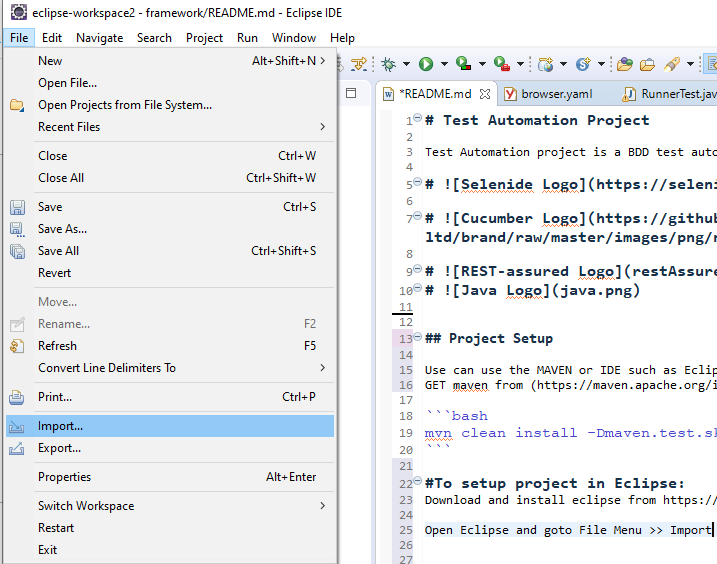
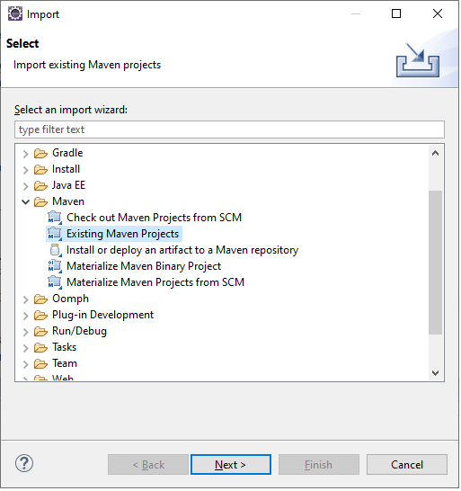
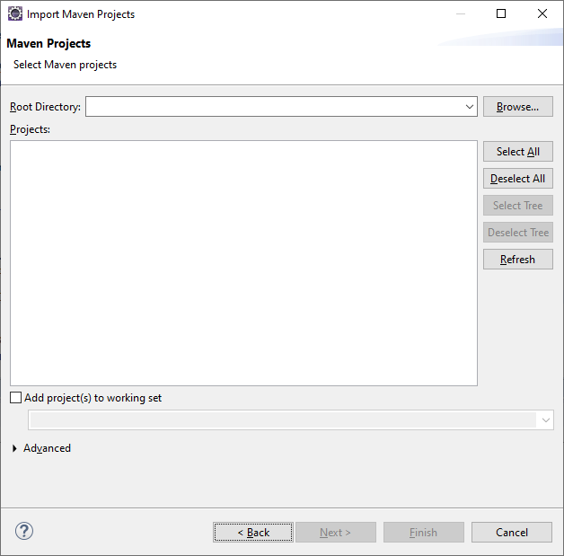
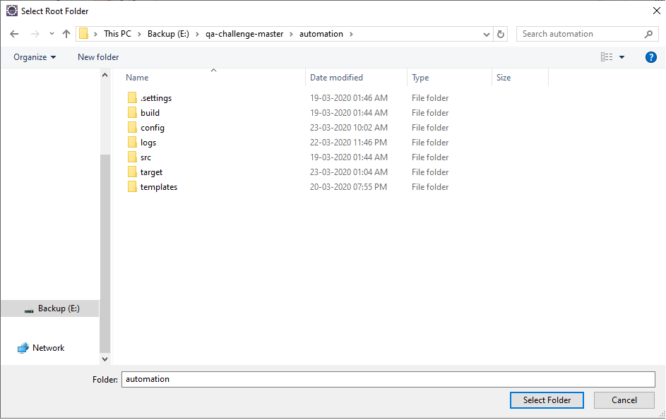
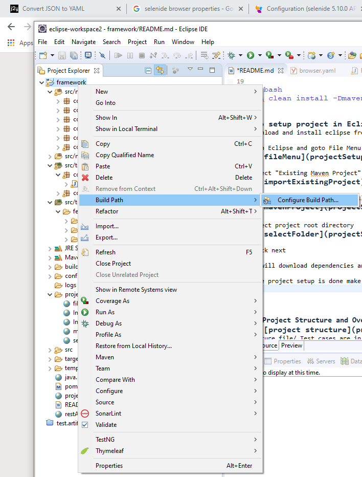
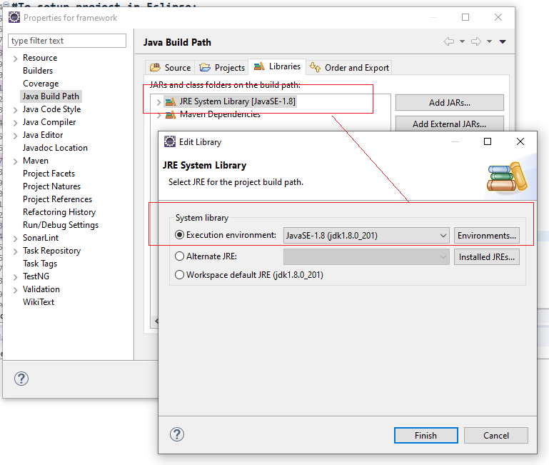
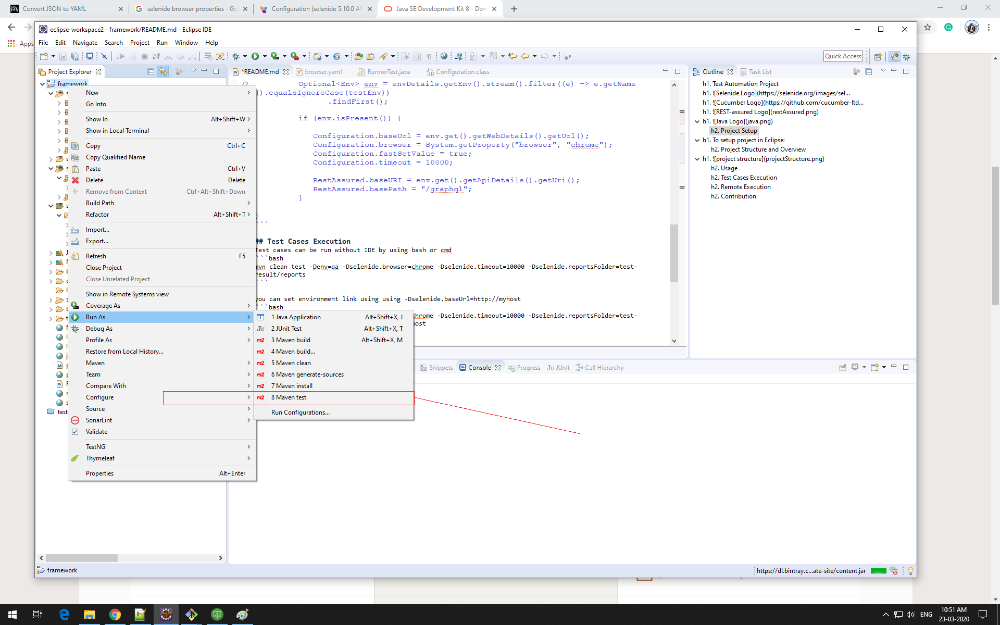
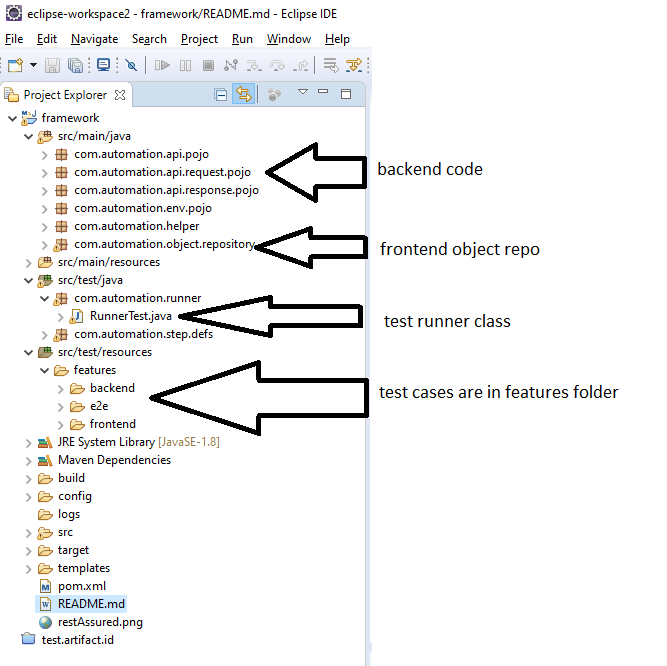

# Test Automation Project

Test Automation project is a BDD test automation framework that includes below technology stack

# 

# 

# 
# 


## Project Setup

pre-requisite - Java 8 has to be install on machine - (https://www.oracle.com/java/technologies/javase/javase-jdk8-downloads.html)

Use can use the MAVEN or IDE such as Eclipse or Intellij to setup the project. 
GET maven from (https://maven.apache.org/install.html) to install the automation project.

```bash
mvn clean install -Dmaven.test.skip=true
```

#To setup project in Eclipse:
Download and install eclipse from https://www.eclipse.org/downloads/ 

Open Eclipse and goto File Menu >> Import
#

select "Existing Maven Project"
#

import maven project window will open
#
 
select project root directory
#

click next

It will download dependencies and generate the project structure

Once project setup is done make sure correct jdk is  selected in build path
#
#


To execute project using Eclipse use below steps:
Right click on project name and select option runas >> maven test
#

## Project Structure and Overview
# 
Feature file/ Test cases are in src/test/resources/features folder

currently there are two feature files for login and shortestRide test cases

Page repository can be found in com.automation.object.repository package

glue code for feature file is in com.automation.step.defs package

## Usage

Env configuration settings are in "/config" folder

browser settings are configurable and can be provide at runtime using maven CLI parameters

```maven

-Dselenide.baseUrl=http://myhost
-Dselenide.browser=ie (* Supported values: "chrome", "firefox", "legacy_firefox" (upto ESR 52), "ie", "opera", "edge")
-Dselenide.fastSetValue=true
-Dselenide.timeout=10000
-Dselenide.reportsFolder=test-result/reports  
```

For unit testing purpose I have used system.getProperty to set variables default value if they are not provided
 
```java
public class RunnerTest {

   
			Environment envDetails = mapper.readValue(new File("config/env.yaml"), Environment.class);
			Optional<Env> env = envDetails.getEnv().stream().filter((e) -> e.getName().equalsIgnoreCase(testEnv))
					.findFirst();

			if (env.isPresent()) {
				
				Configuration.baseUrl = env.get().getWebDetails().getUrl();
				Configuration.browser = System.getProperty("browser", "chrome");
				Configuration.fastSetValue = true;
				Configuration.timeout = 10000;
				
				RestAssured.baseURI = env.get().getApiDetails().getUri();
				RestAssured.basePath = "/graphql";
			}
		
}
```

## Test Cases Execution
Test cases can be run without IDE by using bash or cmd
```bash
mvn clean test -Denv=qa -Dselenide.browser=chrome -Dselenide.timeout=10000 -Dselenide.reportsFolder=test-result/reports 
```

you can set environment link using using -Dselenide.baseUrl=http://myhost
```bash
mvn clean test -Denv=qa -Dselenide.browser=chrome -Dselenide.timeout=10000 -Dselenide.reportsFolder=test-result/reports -Dselenide.baseUrl=http://myhost
```

please note these parameters are not mandatory and if not provided then default are set to chrome and env to qa

To execute project using Eclipse use below steps:
Right click on project name and select option runas >> maven test
projectSetup/maven_run.png


You can also run test cases using IDE and junit. 

provision has been made for parallel execution. It is achieved by running project in verify mvn lifecycle

## Remote Execution

Set below capabilities in @before method  

```java
        String sauceUserName = "XXXXXX";
        String sauceAccessKey = "XXXXXXXXXXXXXXXXXXXX";
        DesiredCapabilities capabilities = new DesiredCapabilities();
        capabilities.setCapability("username", sauceUserName);
        capabilities.setCapability("accessKey", sauceAccessKey);
        capabilities.setCapability("platformName","mac");
        capabilities.setCapability("os_version","10.13");
        Configuration.browserCapabilities = capabilities;
        Configuration.remote="https://ondemand.eu-central-1.saucelabs.com:443/wd/hub";

```

## Contribution

<i>Govardhan Sanap</i>

</br>
<i>+918793342293</i>
